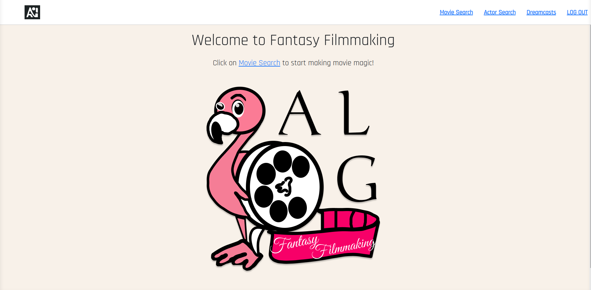
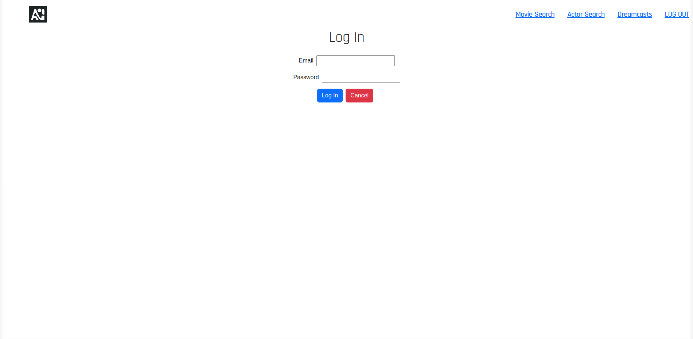
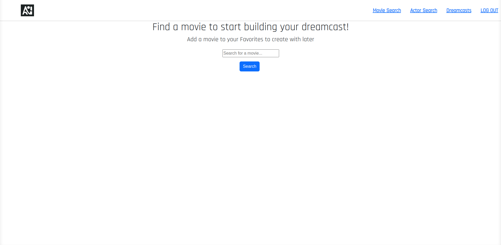
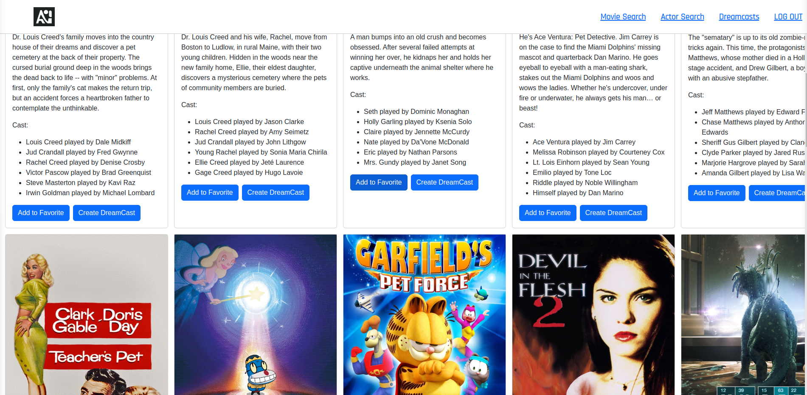
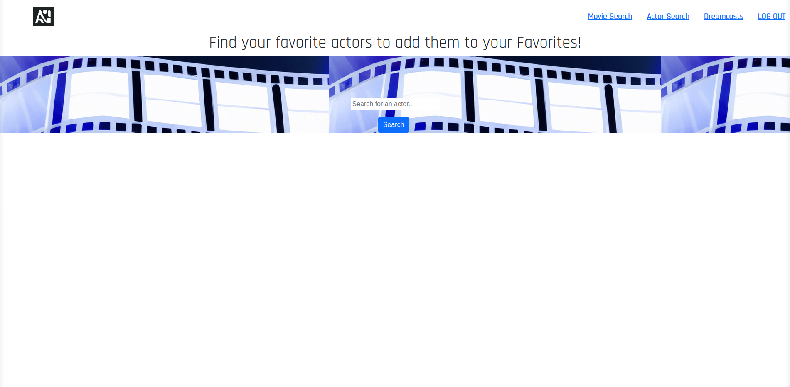
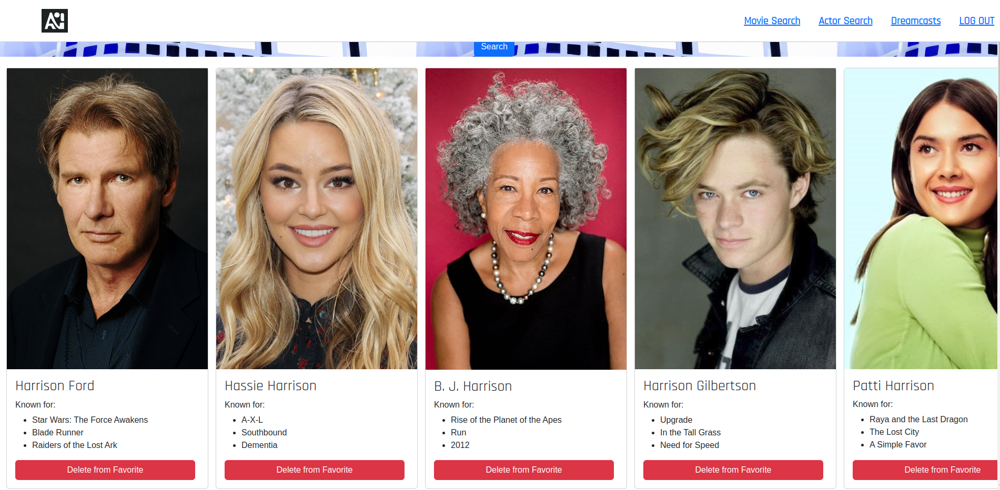
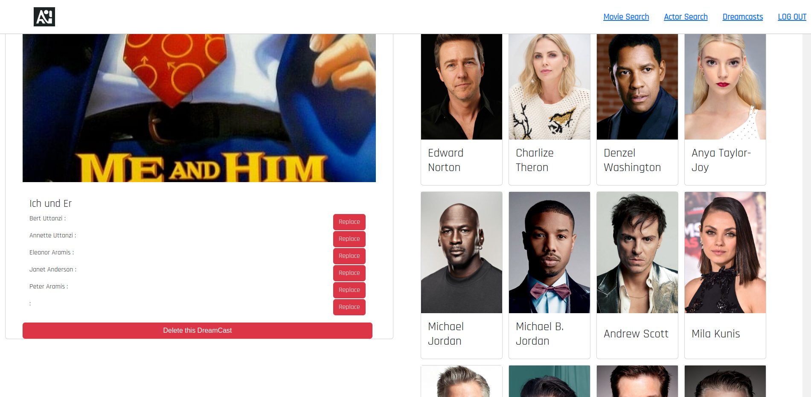

# Filmingo: Fantasy Filmmaking

Click here to create some [Movie Magic!]()

## About Filmingo

Welcome to Filmingo: Fantasy Filmmaking, an ALG Production!

Have you ever thought that though a movie may have been good, it would have been way better had there been a different actor/actress in a particular role? Well, then you have come to the right place.This application is a group project inspired by the concept of creating your own dream movie cast for any movie of your choice. 

Like fantasy sports, the idea of Fantasy Filmmaker is to allow the user the ability to search for any actor or movie that they enjoy and swap out the leading stars for any actor/actress they would prefer for the role. Maybe you enjoyed the Equalizer, but thought Samuel Jackson would give a better performance as Robert McCall than Denzel Washington. Maybe you want Robert de Niro to play Alan Grant in Jurassic Park? All of these options are now available to you here!

## Application Pages

## Planning Materials
-[Trello](https://trello.com/b/nJhah0ta/fantasy-filmmaking)
-[ERD](https://whimsical.com/film-app-3PPzi7oRtLtawhkU9BE7SQ)
-[Wireframe](https://i.postimg.cc/MHD2F9J0/Wireframe.png)

## Technologies Used

-React

-Javascript

-CSS

-HTML

-Mongoose

-MongoDB

-JWT Auth

## Credit to
[TMDB - The Movie Database API](https://www.themoviedb.org/?language=en-US)
Note: This product uses the TMDB API but is not endorsed or certified by TMDB."

Button styling from [Bootstrap](https://getbootstrap.com/), licensed by MIT.

Imagery and logo created using AI : [DALL-E](https://openai.com/dall-e-2/))

## Icebox Items

- [ ] Implement admin functionality
- [ ] Add user profile page displaying dreamcasts & favorite movies/actors
- [ ] Add "hot swap" functionality to quickly switch entire casts of movies
- [ ] Display profile details when clicked
- [ ] Add 'Tyler Perry mode' easter egg (Tyler Perry auto-populates every role in a movie)
- [ ] Add navigation breadcrumbs